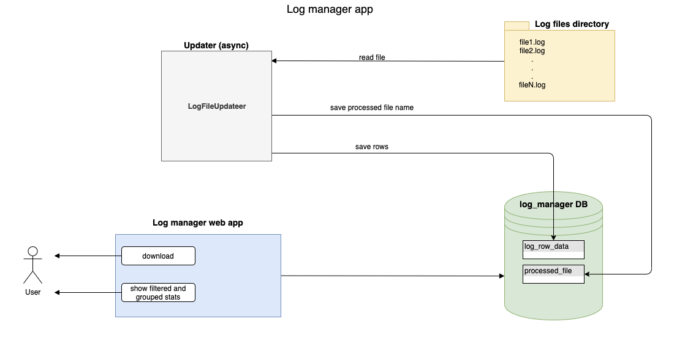

# Log manager project

## 1. How to install

### 1.1 Setup `WEB-APP` application properties

location:
```
/logmanager-web-app/src/main/resources/application.properties
```

required properties (by default is):

```
server.port=8085
spring.datasource.url=jdbc:mysql://localhost:3306/log_manager?createDatabaseIfNotExist=true&useSSL=false
spring.datasource.username=root
spring.datasource.password=root
```

### 1.2 Setup `UPDATER` application properties

location:
```
/updater/src/main/resources/app.properties
```

requred properties:
NOTE: by default prepared test log files will be processed ( see directory `<project dir>/files` )
```
log.files.dir.path=${user.dir}/files
```

### 1.3 Setup `LIQUIBASE` properties

location:
```
/liquibase/liquibase.properties
```

requred properties (by default is):
```
url: jdbc:mysql://localhost:3306/log_manager?createDatabaseIfNotExist=true&amp;useSSL=false
username: root
password: root
```

### 1.4 Go to project parent dir ( `log-manager` ) and execute command
```
mvn clean install
```

### 1.5 Run spring boot app
```
mvn -f logmanager-web-app/pom.xml spring-boot:run
```

## 2. Project diagram


